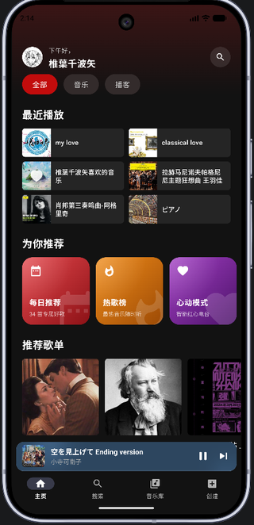
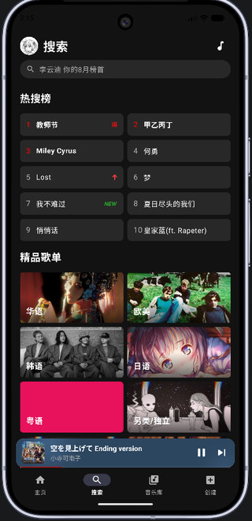
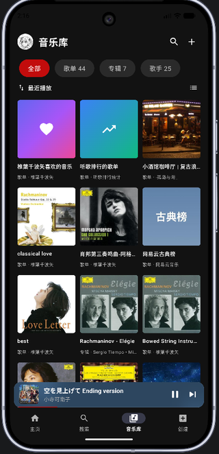
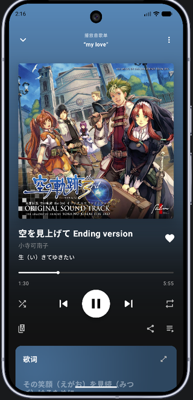
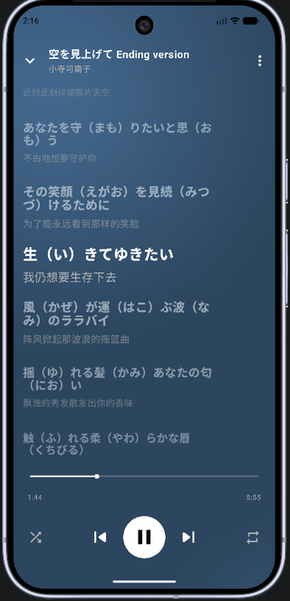

<div align="center">
  

  # Melodia

  轻量级简单的第三方网易云音乐客户端 · Kotlin + Jetpack Compose
</div>

---

## 截图

<div align="center">
  
  
  
  
  
</div>

---

## 项目架构

按**业务域**而非技术层组织：`core` 承载跨域共享能力，`feature` 下每个业务域自持 `data`/`domain`/`ui` 三件套。依赖方向单向收敛——`feature` 可依赖 `core`，`core` 不反向依赖 `feature`，域与域之间无循环依赖。

```text
app/src/main/java/com/lin0721/linmusic/
├── MelodiaApplication.kt        # Koin 初始化与 Coil 预热
├── MainActivity.kt              # Activity 生命周期与桌面歌词权限引导
├── MelodiaApp.kt                # 根组合：布局装配与浮层编排
├── MelodiaNavHost.kt            # 主屏幕切换与路由分发
├── MelodiaOverlays.kt           # 底部浮层、全屏播放器与全局 Toast
├── MelodiaNavigationState.kt    # 导航回退栈与跳转参数
├── MelodiaPlayerSheetState.kt   # 全屏播放器展开/收起状态机
├── MelodiaSidebarState.kt       # 侧边栏推拉状态机
│
├── core/                        # 跨域共享能力
│   ├── api/                     # 账号鉴权接口
│   ├── auth/                    # 登录态、账号信息与登录后同步
│   ├── comment/                 # 评论数据与 UI，被播放器与歌单共用
│   ├── contentfilter/           # 屏蔽艺人过滤
│   ├── log/                     # 日志与崩溃收集
│   ├── model/                   # 跨域共享的数据模型
│   ├── network/                 # 加密、拦截器、统一错误语义与域名常量
│   ├── player/                  # 播放引擎（门面 + 队列/进度/持久化/定时/漫游）
│   ├── preferences/             # 设置项持久化
│   ├── songlike/                # 歌曲红心
│   ├── ui/                      # 通用组件与 Material 3 主题
│   ├── userartist/              # 关注歌手列表
│   └── userplaylist/            # 当前用户歌单列表
│
├── di/                          # Koin 依赖注入模块
│
└── feature/                     # 业务域，各自含 data/domain/ui
    ├── account/                 # 账号中心
    ├── artist/                  # 歌手详情
    ├── cloud/                   # 云盘音乐
    ├── create/                  # 新建歌单等快捷操作
    ├── home/                    # 首页聚合（推荐、日推、排行榜、关注艺人）
    ├── library/                 # 音乐库（歌单/专辑/歌手聚合与检索）
    ├── listendata/              # 听歌数据统计
    ├── message/                 # 消息中心
    ├── music/                   # 音乐 Tab（曲风画像、个性化推荐）
    ├── newworks/                # 新歌首发/新作品推荐
    ├── player/                  # 播放器页面（全屏播放器、歌词、队列、详情）
    ├── playlist/                # 歌单与专辑详情
    ├── podcast/                 # 播客/电台
    ├── recent/                  # 最近播放
    ├── search/                  # 搜索与发现
    └── settings/                # 设置
```

---

## 技术栈与核心选型

- **UI 框架**：Jetpack Compose (Material 3)
- **媒体引擎**：AndroidX Media3 (ExoPlayer + MediaSession)
- **依赖注入**：Koin
- **网络层**：Retrofit2 + OkHttp3 + kotlinx.serialization
- **异步与流式编程**：Kotlin Coroutines + Flow / StateFlow
- **图片加载**：Coil（配置低延迟图片解码与多级缓存）
- **持久化**：Jetpack DataStore & SharedPreferences

---

## 加密与安全路由

所有网络请求的加密与风控规避逻辑均使用 Kotlin 原生复刻，不依赖外部 Node.js 服务：

- **EApi 路由**：MD5 + AES-ECB 加密，请求改写至 `interface.music.163.com` 并伪装移动端特征，用于排行榜、收藏列表、用户歌单及搜索等接口，规避 PC 端风控。
- **WeApi 路由**：AES-CBC + RSA 加密，走 `music.163.com`，用于历史日推及创作者信息等特定接口。
- **设备特征指纹**：拦截器自动注入设备特征与地域伪装头，保障接口调用的稳定性。

同一功能在两种前缀下的可用性由网易风控决定，不可想当然——已验证的结论记录在各接口定义处。

---

## 错误处理

Repository 出口统一返回 `Result`，失败一律为 `AppError` 的子类型（网络 / 风控 / 未登录 / 解析 / 业务码），由 UI 层按类型分流渲染；面向用户的文案集中在 `strings.xml`。

---

## 构建与测试

```bash
./gradlew testDebugUnitTest
```

```bash
./gradlew assembleRelease
```

`release` 已开启 R8 混淆与代码裁剪。Retrofit 接口与 `@Serializable` DTO 有显式 keep 规则——二者被误裁的表现是接口静默解析失败而非崩溃，因此 `assembleRelease` 同时充当混淆规则的回归验证。

签名材料从版本控制之外注入，未配置时自动退回调试签名，`assembleRelease` 始终可产出可安装包。配置方式见 [RELEASE_SIGNING.md](RELEASE_SIGNING.md)。

CI 在推送到 `main` 与 PR 时运行单元测试与 release 构建，产物包含 APK 与 `mapping.txt`。

---

## 非常感谢以下开源项目给我灵感

- [NeteaseCloudMusicApi](https://github.com/binaryify/NeteaseCloudMusicApi)
- [api-enhanced](https://github.com/NeteaseCloudMusicApiEnhanced/api-enhanced)
- [SPlayer](https://github.com/SPlayer-Dev/SPlayer)

---

## ⚠️ 免责声明

1. 本项目为个人技术研究与 Android 原生架构练手项目。
2. 本项目仅供技术交流与学习使用，不提供任何形式的商业变现。
3. 软件内相关数据接口均来自互联网公开的抓包分析，请在下载后 24 小时内删除，严禁用于任何商业用途。
